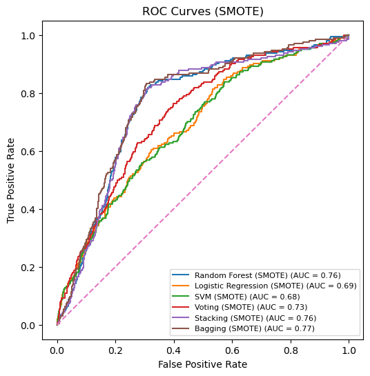
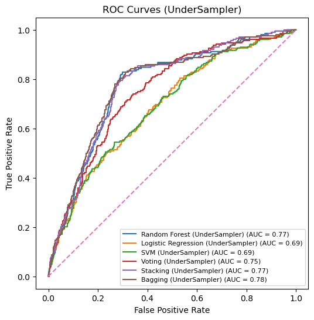
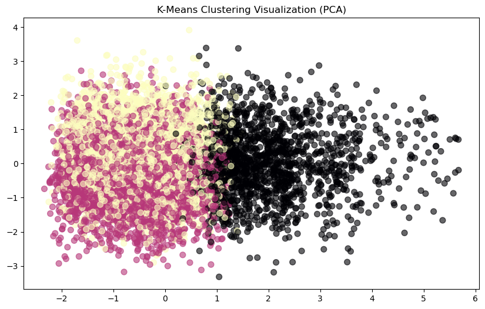

# Customer Churn Prediction: Leakage-Safe Pipeline with MLflow

[](https://colab.research.google.com/github/AsserGharib1/CustomerChurnPrediction/blob/main/customer_churn_prediction.ipynb)
[](https://nbviewer.org/github/AsserGharib1/CustomerChurnPrediction/blob/main/customer_churn_prediction.ipynb)

End-to-end churn classification on the **Customer Churn Business** dataset (OpenML), centered on one question: what does class imbalance do to real churn detection, and which resampling strategy actually fixes it?

## Highlights

- **Leakage-safe preprocessing**: KNN imputation, encoding, and scaling fit on the training split only.
- **Six classifiers benchmarked**: Random Forest, Bagging, Stacking, Voting, Logistic Regression, SVM, across **three imbalance strategies**: SMOTE, random oversampling, and undersampling.
- **Every experiment tracked in MLflow**, selection on F1 and ROC-AUC, not raw accuracy.

## The imbalance story (test set, 204 true churns)

| Setup | Accuracy | F1 | Churns caught |
|---|---|---|---|
| Best model, original imbalanced data (Stacking) | 0.8880 | 0.8505 | **7 / 204** |
| Best model on SMOTE data (Random Forest) | 0.8715 | 0.8471 | n/a |
| Best model with **undersampling** | 0.7220 | 0.7755 | **162 / 204** |

The headline: the highest-*accuracy* model was nearly useless at its actual job (7 churns caught), while undersampling traded a little accuracy for a **23× jump in churn detection**, exactly why F1/recall-driven selection matters.

## Sample outputs







## Also inside

IQR + Isolation Forest outlier analysis, K-Means clustering for data understanding, SelectKBest feature selection, mean/variance audits before vs after imputation.

## Running

```bash
pip install -r requirements.txt
jupyter notebook customer_churn_prediction.ipynb
mlflow ui
```

Dataset: `data/customer_churn_business_dataset.csv` (source: OpenML).
